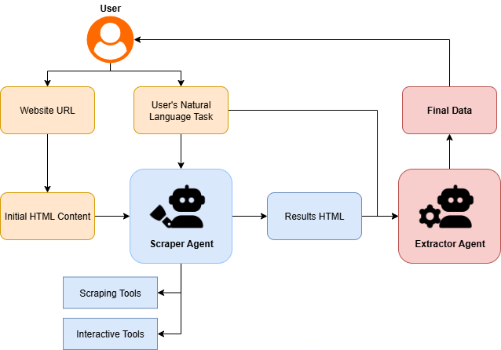

# LLM-Powered Agentic Web Scraper

This project is an intelligent, AI-powered web scraper capable of processing natural language commands. Instead of relying on fixed inputs or complex scripts, users can provide a URL and a plain-English objective, such as "Get me information on cows with a weaning weight below 30". This approach makes web scraping more intuitive, flexible, and accessible.

The core of this scraper is an agentic LLM built with **DSPy** for defining the agent's logic and with the support of **PyDantic** for data validation and structured output. This agent is equipped with a set of specialized tools, primarily powered by **Zendriver**, to interact with web pages dynamically. The entire solution is implemented in Python and includes a robust testing suite using **PyTest**.

## ⚙️ Workflow
Below is a diagram illustrating the workflow of the AI scraper.

<div align="center">
  
</div>

### Step-by-Step Explanation
* **User Input**: The process begins when the user provides the target website's URL and a natural language command (e.g., "Get the table for cows from Alabama with a weight of more than 50 pounds").

* **Initial Page Fetch**: A Python script takes these inputs and fetches the initial HTML content from the given URL.

* **Action Planning (Web Scraping Agent)**: The initial HTML and the user's command are sent to the first LLM, the Web Scraping Agent. This agent analyzes the user's intent and the webpage's structure to determine the correct sequence of actions needed, such as filling out form fields or clicking buttons.

* **Browser Automation**: The Web Scraping Agent executes the planned actions, automating the browser to navigate to the final page that contains the requested data.

* **Data Extraction (Extractor Agent)**: The final HTML of the results page is passed to a second LLM, the Extractor Agent. This agent's specialized task is to parse the HTML, identify the target data, and structure it into a clean table format with headers and rows.

* **Final Output**: The structured data from the Extractor Agent is saved to an output file, completing the scraping process.

#### **Why a Two-Agent System?**
Using a single agent for both navigation and extraction can be inefficient. The Web Scraping Agent maintains an expanding memory of its actions and observations. By the time it navigates to the final results page, its context window may be nearly full. Feeding the entire final HTML into this already-loaded context could lead to truncation and poor-quality data extraction.

Splitting the tasks is a key architectural decision: the **Scraper Agent** focuses solely on browser interaction, while the **Extractor Agent** receives a clean context, allowing it to dedicate its full capacity to high-quality data parsing. This conserves token usage and leverages each model for its specialized capability.

## 🚀 How to Run the Code
1.  **Clone the Repository**
    ```bash
    git clone [https://github.com/soyokaze83/llm-web-scraper.git](https://github.com/soyokaze83/llm-web-scraper.git)
    cd llm-web-scraper
    ```
2.  **`uv` Setup & Dependency Installation**
    ```bash
    uv venv   # Create new virtual environment
    uv sync   # Sync dependencies with pyproject.toml
    ```
3.  **Fill in `.env`**
    ```bash
    cp .env.example .env
    ```
    Here's a description of each environment variable:
    - `API_KEY`: The API key used for the model in the main script.
    - `MODEL_NAME`: Model name for the model used as both scraper and extractor agents.
    - `TEST_API_KEYS`: Multiple API keys separated by commas. Multiple keys can be provided to avoid rate-limiting errors during testing. A single API key will also work.

4.  **Run Script**
    ```bash
    # With python command
    python src/main.py
    # With uv command
    uv run src/main.py
    ```
    The script will then prompt for a URL and a natural language query for what you would like to scrape.


## 🧪 Testing
The project uses `pytest` for testing. To accommodate dynamic web content, test cases can be automatically generated from a given URL using a DSPy-powered script.

First, generate a set of test cases based on the target website:
```bash
# Example URL [https://shorthorn.digitalbeef.com/](https://shorthorn.digitalbeef.com/)
python tests/setup/generate_tests.py --url {WEBSITE_URL}
```

This command will create a `test_cases.json` file with a structure similar to this:
```json
{
  "url": "[https://shorthorn.digitalbeef.com/](https://shorthorn.digitalbeef.com/)",
  "tasks": [
    "Search for an animal with the registration number '12345'",
    "Search for a ranch with the name containing 'ABC'",
    "Search for an animal by tattoo 'XYZ123'",
    "Search for animals with a minimum weaning weight of 50 and a maximum weaning weight of 100",
    "Calculate the due date for a cow bred on '01/01/2025'"
  ]
}
```

Once the test case file is generated, you can run the test suite:
```bash
# With pytest
pytest
# With pytest (recommended verbose mode)
pytest -s -v
# With uv
uv run pytest -s -v
```

## 📄 Example `main.py` Run
```bash
>>> python ./src/main.py
🔗 Enter link: [https://shorthorn.digitalbeef.com/](https://shorthorn.digitalbeef.com/)
❓ What would you like to scrape?
Search for animals with a minimum weaning weight of 50 and a maximum weaning weight of 100

Starting scraper...
Scraper started successfully.
--------------------------------------------------
🤖 Scraper Agent - Calling Tool: type_into_element
    Inputs: {'kwargs': {'css_selector': '#minwwt', 'text': '50'}}
👀 Observation: Successfully typed '50' into element '#minwwt'.
--------------------------------------------------
(output truncated for brevity)
--------------------------------------------------
🤖 Scraper Agent - Calling Tool: _store_and_finish
    Inputs: {'kwargs': {'css_selector': '#dvSearchResults'}}
Storing final HTML content...
👀 Observation: Successfully retrieved and stored the HTML content from selector '#dvSearchResults'. The task is com...
--------------------------------------------------

Extracting final data...
Stopping scraper...
Scraper stopped successfully.
Answer: header=['Reg # Tattoo Name', 'CED', 'BW', 'WW', 'YW', 'MK', 'TM', 'CEM', 'ST', 'YG', 'CW', 'REA', 'FAT', 'MB', '$CEZ', '$BMI', '$CPI', '$F'] data=[['AR4397149 JSF 84N JSF MISS ME 84N', '2', '5.7', '95', '139', '19', '66', '2', '15', '-0.3', '31', '0.63', '-0.08', '0.03', '-6.49', '148.61', '132.11', '70.61'], ...]]

Dumping results into result/result_2932aede-a21e-4ba7-9ac1-38468fa95136.json...
Successfully saved results to result_2932aede-a21e-4ba7-9ac1-38468fa95136.json!
```

## 🗝️ Challenges & Key Learnings
While I have experience with traditional web scraping, building an agentic scraper presented a unique set of challenges.

One of the primary difficulties was managing asynchronous browser events, especially correctly waiting for data to load after an action. Early iterations often failed by attempting to extract data before it was rendered. This was resolved by refining the DSPy signature for the scraper agent, enforcing more robust retry logic for its `wait_loading` tool.

Another significant challenge was managing the token limits and rate-limiting of the underlying LLM API (in this case, Google's Gemini family). This constraint directly led to the two-agent design described above, which proved crucial for conserving token usage and maintaining high-quality, non-truncated output.

This project was a fantastic learning experience in applying agentic AI patterns to real-world automation tasks and handling the practical limitations of LLMs.
